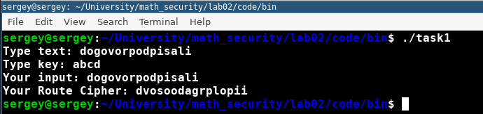
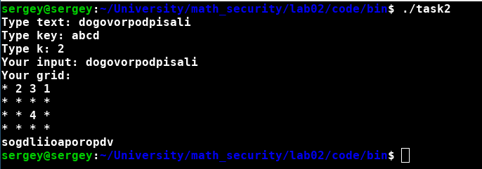
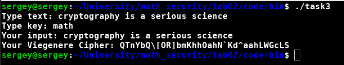

---
# Front matter
lang: ru-RU
title: "Отчет по лабораторной работе № 2. Шифры перестановки"
subtitle: "дисциплина: Математические основы защиты информации и информационной безопасности"
author: "Наливайко Сергей Максимович"

# Formatting
toc-title: "Содержание"
toc: true # Table of contents
toc_depth: 2
lof: false # List of figures
lot: false # List of tables
fontsize: 12pt
linestretch: 1.5
papersize: a4paper
documentclass: scrreprt
polyglossia-lang: russian
polyglossia-otherlangs: english
mainfont: PT Serif
romanfont: PT Serif
sansfont: PT Sans
monofont: PT Mono
mainfontoptions: Ligatures=TeX
romanfontoptions: Ligatures=TeX
sansfontoptions: Ligatures=TeX,Scale=MatchLowercase
monofontoptions: Scale=MatchLowercase
indent: true
pdf-engine: lualatex
header-includes:
  - \linepenalty=10 # the penalty added to the badness of each line within a paragraph (no associated penalty node) Increasing the value makes tex try to have fewer lines in the paragraph.
  - \interlinepenalty=0 # value of the penalty (node) added after each line of a paragraph.
  - \hyphenpenalty=50 # the penalty for line breaking at an automatically inserted hyphen
  - \exhyphenpenalty=50 # the penalty for line breaking at an explicit hyphen
  - \binoppenalty=700 # the penalty for breaking a line at a binary operator
  - \relpenalty=500 # the penalty for breaking a line at a relation
  - \clubpenalty=150 # extra penalty for breaking after first line of a paragraph
  - \widowpenalty=150 # extra penalty for breaking before last line of a paragraph
  - \displaywidowpenalty=50 # extra penalty for breaking before last line before a display math
  - \brokenpenalty=100 # extra penalty for page breaking after a hyphenated line
  - \predisplaypenalty=10000 # penalty for breaking before a display
  - \postdisplaypenalty=0 # penalty for breaking after a display
  - \floatingpenalty = 20000 # penalty for splitting an insertion (can only be split footnote in standard LaTeX)
  - \raggedbottom # or \flushbottom
  - \usepackage{float} # keep figures where there are in the text
  - \floatplacement{figure}{H} # keep figures where there are in the text
---

# Цель работы

Научиться реализовывать алгоритмы шифрования перестановкой.

# Задание

- Реализовать маршрутное шифрование.
- Реализовать шифрование с помощью решеток.
- Реализовать шифр Виженера.


# Выполнение лабораторной работы

## Маршрутное шифрование

Реализуем маршрутное шифрование на языке программирования C++. Код программы представлен ниже.

```c++
std::string Route_Cipher::crypt(const std::string &text,
                                    const std::string &key) {

        if(text.size() < key.size())
            throw std::invalid_argument("text_length must be bigger then password_length");

        std::map<char, size_t> ordered_pass;
        for(size_t i = 0; i < key.size(); ++i) {
            if(!ordered_pass.insert({tolower(key[i]), i}).second)
                throw std::invalid_argument("all password characters must be unique");
        }

        size_t col = key.size();
        size_t row = text.size() / col + (text.size() % col == 0  ? 0: 1);
        std::vector<std::vector<char>> matrix(row, std::vector<char>(col, 'a'));
        std::stringstream ss;

        for(size_t i = 0, k = 0; i < row; ++i) {
            for(size_t j = 0; j < col && k < text.length(); ++j, ++k)
                matrix[i][j] = text[i * col + j];
        }

        for(auto element: ordered_pass) {
            size_t j = element.second;
            for(size_t i = 0; i < row; ++i) {
                ss << matrix[i][j];
            }
        }

        return ss.str();
    }
```

Полный листинг программного кода точки входа в программу и шифрования прикреплен в архиве (code/task1.cpp и code/crypters/route_cipher.cpp).

Скомпилируем и запустим программу @fig:001.

{ #fig:001 width=70% }


## Шифрование с помощью решеток.

Полный листинг программного кода точки входа в программу и шифрования прикреплен в архиве (code/task2.cpp и code/crypters/route_cipher.cpp).

Полный код алгоритма шифрования здесь не будет приведен, в связи с громоздкостью (множество вспомогательных методов переворота решетки, проверки корректности данных и т. д.).

Скомпилируем и запустим программу @fig:002.

{ #fig:002 width=70% }


## Шифр Виженера

Реализуем алгоритм шифрования на языке программирования C++. Код программы представлен ниже.

```c++
std::string Vigenere_Cipher::crypt(const std::string &text, const std::string &key) {
        std::stringstream ss, nk;
        nk << key;
        int k = text.size() - key.size();
        for(int i = 0; i < k; ++i) {
            nk << (key[i % key.size()]);
        }
        std::string new_key{nk.str()};

        for(int i = 0; i < text.size(); ++i) {
            char letter = (text[i] - ' ' + new_key[i] - ' ') % 95 + ' ';
            ss << letter;
        }

        return ss.str();
    }
```

Полный листинг программного кода точки входа в программу и шифрования прикреплен в архиве (code/task3.cpp и code/crypters/viginer_cipher.cpp).

Скомпилируем и запустим программу @fig:003.

{ #fig:003 width=70% }

# Выводы

В ходе лабораторной работы мы научились реализовывать алгоритмы шифрования перестановкой.