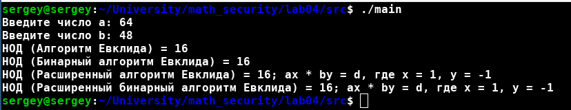

---
# Front matter
lang: ru-RU
title: "Отчет по лабораторной работе № 4. Вычисление наибольшего общего делителя"
subtitle: "дисциплина: Математические основы защиты информации и информационной безопасности"
author: "Наливайко Сергей Максимович"

# Formatting
toc-title: "Содержание"
toc: true # Table of contents
toc_depth: 2
lof: false # List of figures
lot: false # List of tables
fontsize: 12pt
linestretch: 1.5
papersize: a4paper
documentclass: scrreprt
polyglossia-lang: russian
polyglossia-otherlangs: english
mainfont: PT Serif
romanfont: PT Serif
sansfont: PT Sans
monofont: PT Mono
mainfontoptions: Ligatures=TeX
romanfontoptions: Ligatures=TeX
sansfontoptions: Ligatures=TeX,Scale=MatchLowercase
monofontoptions: Scale=MatchLowercase
indent: true
pdf-engine: lualatex
header-includes:
  - \linepenalty=10 # the penalty added to the badness of each line within a paragraph (no associated penalty node) Increasing the value makes tex try to have fewer lines in the paragraph.
  - \interlinepenalty=0 # value of the penalty (node) added after each line of a paragraph.
  - \hyphenpenalty=50 # the penalty for line breaking at an automatically inserted hyphen
  - \exhyphenpenalty=50 # the penalty for line breaking at an explicit hyphen
  - \binoppenalty=700 # the penalty for breaking a line at a binary operator
  - \relpenalty=500 # the penalty for breaking a line at a relation
  - \clubpenalty=150 # extra penalty for breaking after first line of a paragraph
  - \widowpenalty=150 # extra penalty for breaking before last line of a paragraph
  - \displaywidowpenalty=50 # extra penalty for breaking before last line before a display math
  - \brokenpenalty=100 # extra penalty for page breaking after a hyphenated line
  - \predisplaypenalty=10000 # penalty for breaking before a display
  - \postdisplaypenalty=0 # penalty for breaking after a display
  - \floatingpenalty = 20000 # penalty for splitting an insertion (can only be split footnote in standard LaTeX)
  - \raggedbottom # or \flushbottom
  - \usepackage{float} # keep figures where there are in the text
  - \floatplacement{figure}{H} # keep figures where there are in the text
---

# Цель работы

Научиться реализовывать алгоритмы нахождение НОД.

# Задание

- Реализовать алгоритм Евклида нахождения НОД 
- Реализовать бинарный алгоритм Евклида нахождения НОД 
- Реализовать расширенный алгоритм Евклида нахождения НОД 
- Реализовать расширенный бинарный алгоритм Евклида нахождения НОД 
  
# Выполнение лабораторной работы

## Реализация алгоритмов нахождения НОД

Реализуем алгоритмы нахождения НОД на языке программирования C++.

Код функции нахождения НОД для первого алгоритма: 

```c++
int euclidean_algorithm(int a, int b) {
    return b == 0 ? a : euclidean_algorithm(b, a % b);
}
```

Код функции нахождения НОД для второго алгоритма: 

```c++
int bin_euclidean_algorithm(int a, int b) {
    if (b <= 0 || a <= 0)
        throw std::invalid_argument("numbers must be greater than zero");
    if(a < b)
        std::swap(a, b);
    int g = 1;
    while ((a % 2 == 0) && ( b % 2 == 0))
    {
        a /= 2;
        b /= 2;
        g *= 2;
    }
    int u = a, v = b;
    while (u != 0)
    {
        while (u % 2 == 0) u /= 2;
        while (v % 2 == 0) v /= 2;
        if (u >= v)
            u -= v;
        else
            v -= u;
    }
    return v * g;
}

```

Код функции нахождения НОД для третьего алгоритма: 

```c++
int ext_euclidean_algorithm(int a, int b,  int &x, int &y) {
    if (b < 0 || a < 0)
        throw std::invalid_argument("numbers must be greater than zero");
    if(a < b)
        std::swap(a, b);

    int s, d;

    if (b == 0) {
        d = a;
        x = 1;
        y = 0;
        return d;
    }

    d = ext_euclidean_algorithm(b,a % b,x,y);
    s = y;
    y = x - (a / b) * (y);
    x = s;
    return d;
}
```

Код функции нахождения НОД для четвертого алгоритма: 

```c++
int ext_bin_euclidean_algorithm(int a, int b, int &x, int &y) {
    if (b <= 0 || a <= 0)
        throw std::invalid_argument("numbers must be greater than zero");
    if(a < b)
        std::swap(a, b);

    int g = 1;
    while ((a % 2 == 0) && ( b % 2 == 0))
    {
        a /= 2;
        b /= 2;
        g *= 2;
    }
    int u = a, v = b, A = 1, B = 0, C = 0, D = 1;
    while (u != 0)
    {
        while (u % 2 == 0) {
            u /= 2;

            if ((A % 2 == 0) && (B % 2 == 0)) {
                A /= 2;
                B /= 2;
            } else {
                A = (A + b) / 2;
                B = (B - a) / 2;
            }
        }
        while (v % 2 == 0) {
            v /= 2;

            if ((C % 2 == 0) && (D % 2 == 0)) {
                C /= 2;
                D /= 2;
            } else {
                C = (C + b) / 2;
                D = (D - a) / 2;
            }
        }
        if (u >= v) {
            u -= v;
            A -= C;
            B -= D;
        }
        else {
            v -= u;
            C -= A;
            D -= B;
        }
    }
    x = C;
    y = D;
    return v * g;
}
```

Полный листинг программного кода представлен в файле main.cpp (архив lab04, директория src).

Скомпилируем и запустим программу @fig:001.

{ #fig:001 width=70% }

# Выводы

В ходе лабораторной работы мы реализовывали алгоритмы нахождение НОД.