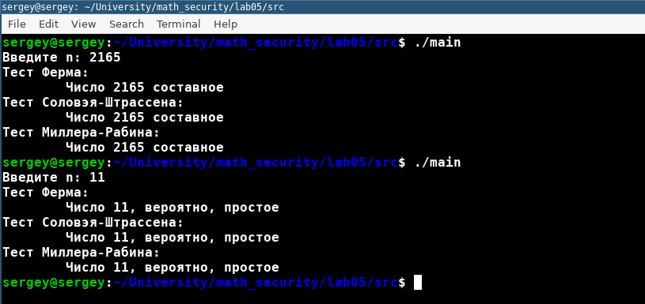

---
# Front matter
lang: ru-RU
title: "Отчет по лабораторной работе № 5. Вероятностные алгоритмы проверки чисел на простоту"
subtitle: "дисциплина: Математические основы защиты информации и информационной безопасности"
author: "Наливайко Сергей Максимович"

# Formatting
toc-title: "Содержание"
toc: true # Table of contents
toc_depth: 2
lof: false # List of figures
lot: false # List of tables
fontsize: 12pt
linestretch: 1.5
papersize: a4paper
documentclass: scrreprt
polyglossia-lang: russian
polyglossia-otherlangs: english
mainfont: PT Serif
romanfont: PT Serif
sansfont: PT Sans
monofont: PT Mono
mainfontoptions: Ligatures=TeX
romanfontoptions: Ligatures=TeX
sansfontoptions: Ligatures=TeX,Scale=MatchLowercase
monofontoptions: Scale=MatchLowercase
indent: true
pdf-engine: lualatex
header-includes:
  - \linepenalty=10 # the penalty added to the badness of each line within a paragraph (no associated penalty node) Increasing the value makes tex try to have fewer lines in the paragraph.
  - \interlinepenalty=0 # value of the penalty (node) added after each line of a paragraph.
  - \hyphenpenalty=50 # the penalty for line breaking at an automatically inserted hyphen
  - \exhyphenpenalty=50 # the penalty for line breaking at an explicit hyphen
  - \binoppenalty=700 # the penalty for breaking a line at a binary operator
  - \relpenalty=500 # the penalty for breaking a line at a relation
  - \clubpenalty=150 # extra penalty for breaking after first line of a paragraph
  - \widowpenalty=150 # extra penalty for breaking before last line of a paragraph
  - \displaywidowpenalty=50 # extra penalty for breaking before last line before a display math
  - \brokenpenalty=100 # extra penalty for page breaking after a hyphenated line
  - \predisplaypenalty=10000 # penalty for breaking before a display
  - \postdisplaypenalty=0 # penalty for breaking after a display
  - \floatingpenalty = 20000 # penalty for splitting an insertion (can only be split footnote in standard LaTeX)
  - \raggedbottom # or \flushbottom
  - \usepackage{float} # keep figures where there are in the text
  - \floatplacement{figure}{H} # keep figures where there are in the text
---

# Цель работы

Научиться реализовывать вероятностные алгоритмы проверки чисел на простоту.

# Задание

- Реализовать алгоритм, реализующий тест Ферма. 
- Реализовать алгоритм вычисления числа Якоби.
- Реализовать алгоритм, реализующий тест Соловея-Штрассена.
- Реализовать алгоритм, реализующий тест Миллера-Рабина.
  
# Выполнение лабораторной работы

## Реализация вероятностных алгоритмов

Реализуем вероятностные алгоритмы проверки чисел на простоту на языке программирования C++.

Код алгоритма, реализующего тест Ферма: 

```c++
bool ferma_test(uint_fast64_t n) {
    if (n < 5)
        throw std::invalid_argument("n >= 5!");
    if (n % 2 == 0)
        return false;
    std::srand(std::time(nullptr));
    for(int i = 0; i < TEST_ITERATIONS; ++i) {
        uint_fast64_t a = (std::rand() % (n - 3) + 2);
        uint_fast64_t r = 1;
        for(int j = 1; j < n; ++j) r *= a;
        r %= n;
        if(r == 1)
            return true;
    }
    return false;
}
```

Код алгоритма нахождения числа Якоби:

```c++
int jacobi(int a, int b) {

    int g;
    if (a >= b) a %= b;
    if (a == 0) return 0;
    if (a == 1) return 1;
    if (a < 0) {
        if ((b-1)/2 % 2 == 0)
            return jacobi(-a,b);
        else
            return -jacobi(-a,b);
    }
    if (a % 2 == 0) {
        if (((b*b - 1)/8) % 2 == 0)
            return jacobi(a/2,b);
        else
            return -jacobi(a/2,b);
    }
    g = euclidean_algorithm(a,b);
    if (g == a)
        return 0;
    else if (g != 1)
        return jacobi(g,b)*jacobi(a/g,b);

    else if (((a-1)*(b-1)/4) % 2 == 0)
        return jacobi(b,a);
    else
        return -jacobi(b,a);
}
```

Код алгоритма, реализующего тест Соловея-Штрассена:

```c++
bool s_sh_test(ulong n) {
    if (n < 5)
        throw std::invalid_argument("n >= 5!");
    if (n % 2 == 0)
        return false;
    std::srand(std::time(nullptr));
    for(int i = 0; i < TEST_ITERATIONS; ++i) {
        uint_fast64_t a = (std::rand() % (n - 3) + 2);
        if(euclidean_algorithm(a, n) > 1)
            return false;
        uint_fast64_t r = 1;
        for(int j = 1; j <= ((n - 1)/2); ++j)
            r *= a;
        int s = jacobi(a, n);

        if(((r - s) % n) != 0)
            return false;

    }

    return true;
}
```

Код алгоритма, реализующего тест Миллера-Рабина:

```c++
ulong mulmod(ulong a, ulong b, ulong mod)
{
    ulong x = 0,y = a % mod;
    while (b > 0)
    {
        if (b % 2 == 1)
        {
            x = (x + y) % mod;
        }
        y = (y * 2) % mod;
        b /= 2;
    }
    return x % mod;
}


ulong modulo(ulong base, ulong exponent, ulong mod)
{
    ulong x = 1;
    ulong y = base;
    while (exponent > 0)
    {
        if (exponent % 2 == 1)
            x = (x * y) % mod;
        y = (y * y) % mod;
        exponent = exponent / 2;
    }
    return x % mod;
}

bool m_r_test(ulong p)
{
    if (p < 2)
    {
        return false;
    }
    if (p != 2 && p % 2==0)
    {
        return false;
    }
    ulong s = p - 1;
    while (s % 2 == 0)
    {
        s /= 2;
    }
    for (int i = 0; i < TEST_ITERATIONS; i++)
    {
        ulong a = rand() % (p - 1) + 1, temp = s;
        ulong mod = modulo(a, temp, p);
        while (temp != p - 1 && mod != 1 && mod != p - 1)
        {
            mod = mulmod(mod, mod, p);
            temp *= 2;
        }
        if (mod != p - 1 && temp % 2 == 0)
        {
            return false;
        }
    }
    return true;
}

```

Полный листинг программного кода представлен в файле main.cpp (архив lab05, директория src).

Скомпилируем и запустим программу @fig:001.

{ #fig:001 width=70% }

# Выводы

В ходе лабораторной работы мы реализовывали вероятностные алгоритмы проверки чисел на простоту.