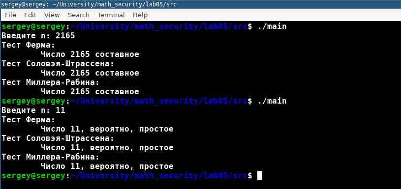

---
## Front matter
lang: ru-RU
title: Презентация лабораторной работы № 5. Вероятностные алгоритмы проверки чисел на простоту
subtitle: "дисциплина: Математические основы защиты информации и информационной безопасности"
author: Наливайко Сергей Максимович

## Formatting
toc: false
slide_level: 2
theme: metropolis
header-includes: 
 - \metroset{progressbar=frametitle,sectionpage=progressbar,numbering=fraction}
 - '\makeatletter'
 - '\beamer@ignorenonframefalse'
 - '\makeatother'
aspectratio: 43
section-titles: true
---

# Цель работы

## Цель работы

Научиться реализовывать вероятностные алгоритмы проверки чисел на простоту.

## Задание

- Реализовать алгоритм, реализующий тест Ферма. 
- Реализовать алгоритм вычисления числа Якоби.
- Реализовать алгоритм, реализующий тест Соловея-Штрассена.
- Реализовать алгоритм, реализующий тест Миллера-Рабина.

# Выполнение лабораторной работы

## Реализация вероятностных алгоритмов

{ #fig:001 width=70% }

# Выводы

## Выводы

В ходе лабораторной работы мы реализовывали вероятностные алгоритмы проверки чисел на простоту.