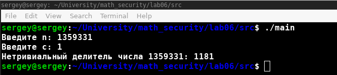

---
## Front matter
lang: ru-RU
title: Презентация лабораторной работы № 6. Разложение чисел на множители
subtitle: "дисциплина: Математические основы защиты информации и информационной безопасности"
author: Наливайко Сергей Максимович

## Formatting
toc: false
slide_level: 2
theme: metropolis
header-includes: 
 - \metroset{progressbar=frametitle,sectionpage=progressbar,numbering=fraction}
 - '\makeatletter'
 - '\beamer@ignorenonframefalse'
 - '\makeatother'
aspectratio: 43
section-titles: true
---

# Цель работы

## Цель работы

Научиться реализовывать алгоритмы разложения чисел на множители.

## Задание

- Реализовать алгоритм, реализующий р-метод Полларда.

# Выполнение лабораторной работы

## Реализация алгоритма разложения чисел на множители

{ #fig:001 width=70% }

# Выводы

## Выводы

В ходе лабораторной работы мы реализовывали алгоритмы разложения чисел на множители.