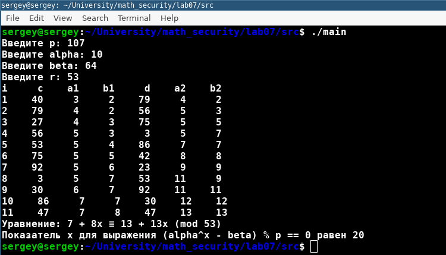

---
## Front matter
lang: ru-RU
title: Презентация лабораторной работы № 7. Дискретное логарифмирование в конечном поле
subtitle: "дисциплина: Математические основы защиты информации и информационной безопасности"
author: Наливайко Сергей Максимович

## Formatting
toc: false
slide_level: 2
theme: metropolis
header-includes: 
 - \metroset{progressbar=frametitle,sectionpage=progressbar,numbering=fraction}
 - '\makeatletter'
 - '\beamer@ignorenonframefalse'
 - '\makeatother'
aspectratio: 43
section-titles: true
---

# Цель работы

## Цель работы

Познакомиться с дискретным логарифмированием в конечном поле и реализовать алгоритм, реализующий р-метод Полларда.

## Задание

- Реализовать алгоритм, реализующий р-метод Полларда для задач дискретного логарифмирования.

# Выполнение лабораторной работы

## Реализация алгоритма дискретного логарифмирования

{ #fig:001 width=70% }

# Выводы

## Выводы

В ходе работы мы познакомились с дискретным логарифмированием в конечном поле и реализовали алгоритм, реализующий р-метод Полларда.